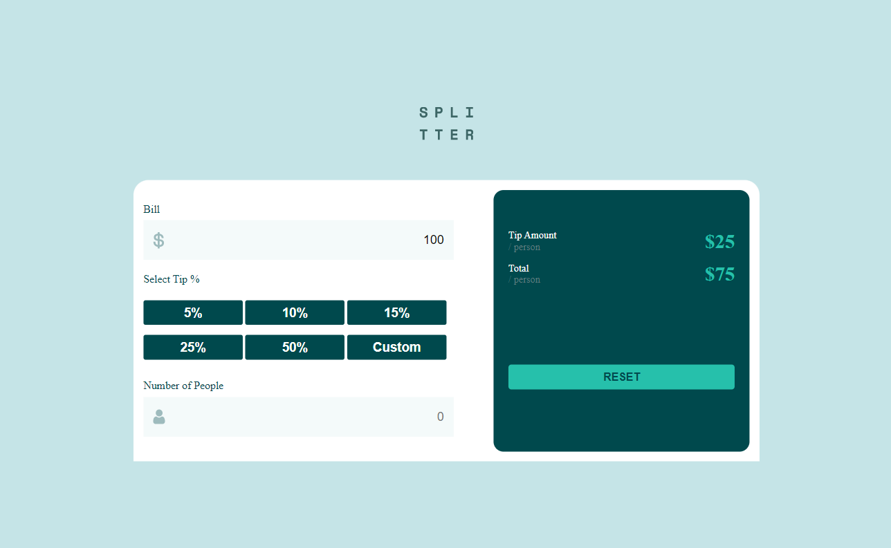
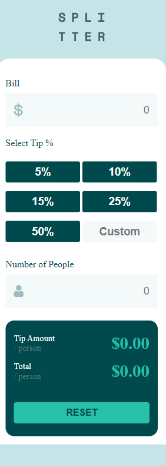

# Frontend Mentor - Tip calculator app solution

This is my solution to the [Tip calculator app challenge on Frontend Mentor](https://www.frontendmentor.io/challenges/tip-calculator-app-ugJNGbJUX). Frontend Mentor challenges help you improve your coding skills by building realistic projects.

## Overview
The site is made for screen sizes 1440px, so you may need to zoom out to see it properly.

### The challenge

Users should be able to:

- View the optimal layout for the app depending on their device's screen size
- See hover states for all interactive elements on the page
- Calculate the correct tip and total cost of the bill per person

### Screenshot

### Links

- Live Site URL: [Calculator link](https://wizzy-design.github.io/tip-calculator-app-main/)

## My process

### Built with

- Semantic HTML5 markup
- CSS custom properties
- Flexbox
- Mobile-first workflow
- Google searches 😁

## Author

- Website - [Wisdom Ochei](https://wizzy-design.github.io/wisdom_portfolio/)
- Twitter - [@WisdomOchei](https://www.twitter.com/WisdomOchei)

